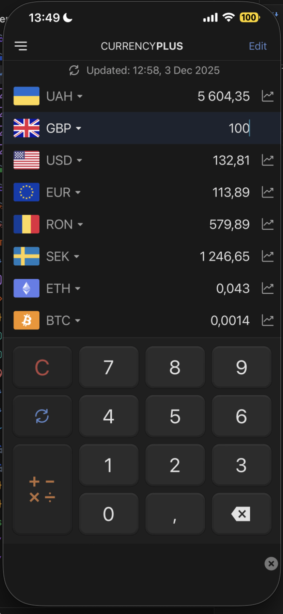
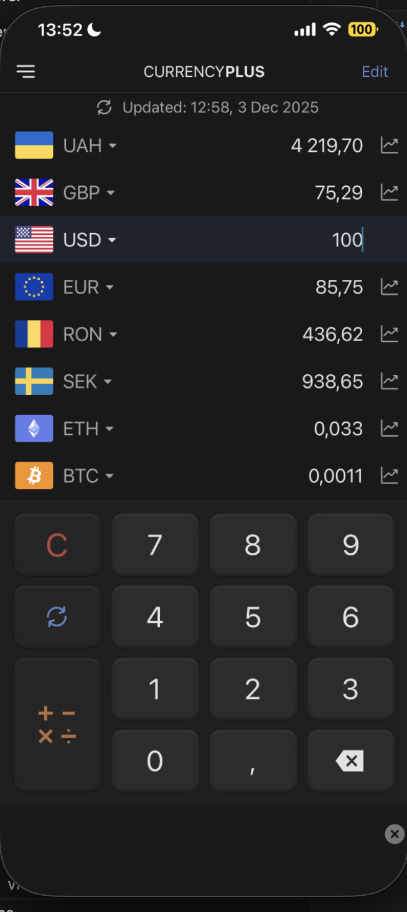
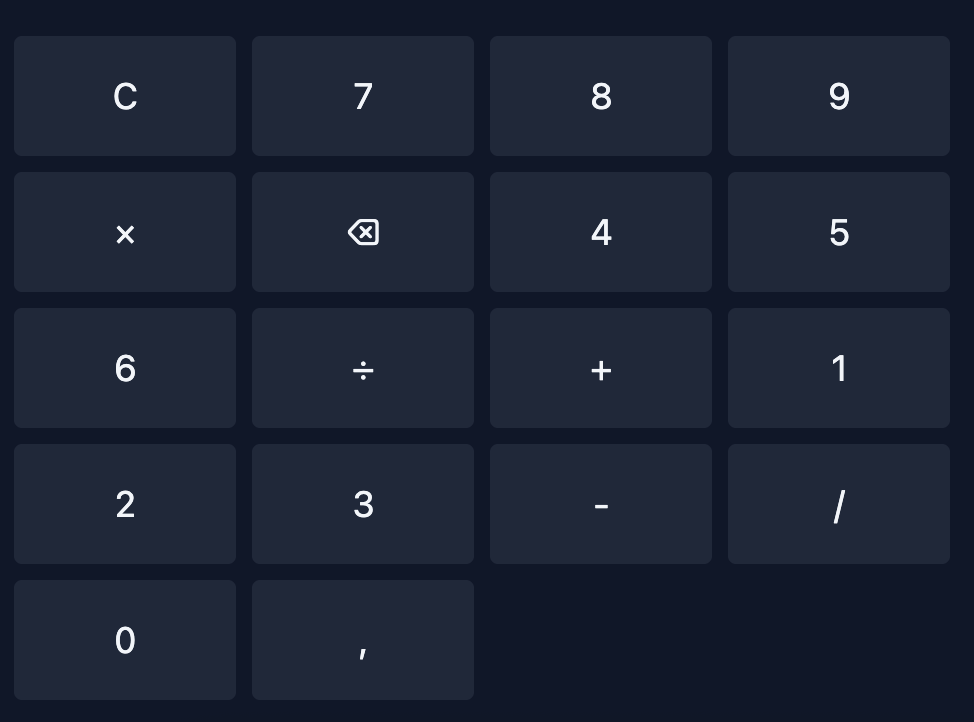

1.  conversion not correct.
2. Remove  — I want to input amount inline:  in front of base currency.

2.1. Main page  list of currency should be scrollable; when I tap a currency it becomes active and lets me input amount. On the screen I input `100 GBP` and it converts other rows.
2.2. I tap `USD` field  and `USD` row becomes active; if I input `100` it converts all other non-active rows .

3. Keyboard buttons still not correct layout 
4. Design adjust for mobile first.

Image reference list
- image.png – current bottom bar that should be removed.
- image-1.png – incorrect conversion output example.
- image-2.png – desired inline amount input location.
- image-3.png – keypad layout that needs fixing.
- image-4.png – main screen with GBP 100 entered.
- image-5.png – USD row selected/active.
- image-6.png – conversions after USD active input.

